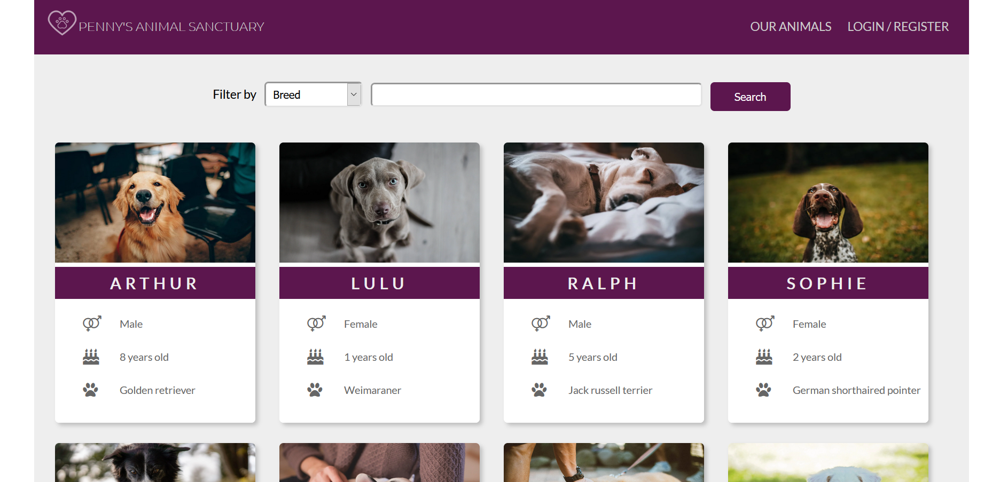
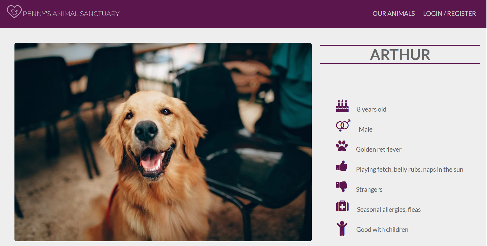
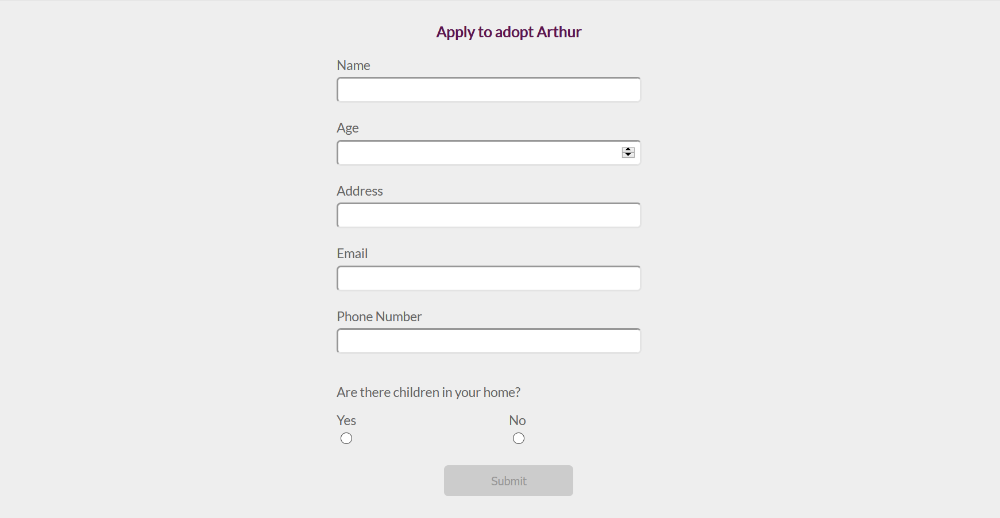

# Penny's Animal Sanctuary - Demo animal adoption website
Modern, responsive demo website created for a fictional dog adoption organization. The React UI is made to interact with a custom-built REST API (see animal-sanctuary-backend repository for more information).

### Table of Contents
- [Introduction](#Introduction)
- [Technologies](#Technologies)
- [Features](#Features)
- [Setup](#Setup)
- [Author info](#Author info)

### Introduction
___
My goal with this project was to build a responsive, component-driven, single-page React app to query a custom backend. This app is a cleanly-designed and easy to navigate web app to solve the everyday business problems of a small non-profit.
Users can sign up for an accout and submit applications to adopt an animal. Those applications can be queried by administrators. The site tracks a user's applications and updates the UI intuitively.
Users may utilitized filtered search to narrow results. Clicking on an animal's card component will redirect to a details page. Navigation is handled seamlessly through React router.

I embarked on this portfolio project to demonstrate and hone my React skills. The app is built entirely with reusable, functional components and relies heavily on React Hooks for a modern implementation. 
This is my FIRST full-stack project! It employs the MERN (MongoDB, Express, React, Node.js) stack when paired with my REST API.

### Technologies
___
- React v 17.0.1
- React-Router-Dom v 5.2.0
- React-Transition-Group v 4.4.1
- Simple-React-Validator v 1.6.0
- FontAwesome SVG-icons v 5.15.2
- Hosted with Firebase

### Features 
___
##### Homepage
All visitors come straight to the homepage. Search bar allows them to filter by breed, gender and age. Clicking on a dog's card will lead to a details page where logged in users can apply to adopt that animal.

##### Details
Styled details page pulls dynamic data from the MongoDB database for each animal. Page displays how many applications are pending for each dog and allows user to submit application.

##### Application
Logged in users enter their information into the application form. Form inputs are verified in React. Submit button is disabled until all required fields are satisfied. Applications are saved in database with references to the user and animal.

##### Admin Only
Only authorized administrators have access to the "Create New" and "Edit Animal" routes. They are able to add a new dog to the database, or update/delete. For further screenshots, visit the Assets folder of this repo.

##### Front-end error handling
All network and user errors are handled with a reusable, styled Modal component which displays a formatted error message.

### Setup
___
This project was bootstrapped with create-react-app

Environment variable: REACT_APP_URL=https://animal-sanctuary.herokuapp.com/api

Click [HERE](https://pennyssanctuary.web.app/) to visit a live demo site hosted on Firebase!

### Author info
___
This is an original app coded from scratch by ME, Claire Smith, a self-taught web developer in Lafayette, Indiana. Much thanks to some great teachers on Udemy: Jonas Schmedtmann and Maximilian Schwarzmuller of Academind for the confidence and techniques!

